# EviCode

**Understanding Verification Evidence for Machine-Generated Code**

EviCode studies semantic verification as an **evidence decomposition** problem. Instead of asking only whether a generated program is correct, EviCode asks which evidence sources support that decision: syntax validity, normalized control-flow structure, normalized structural statistics, operator-family profiles, identifier-role distributions, data-flow proxies, and execution.

The current artifact evaluates this idea on HumanEval-X translation verification and an external Python-to-Java LLM prediction set from DeepSeekCoder, QwenCoder, and StarCoder.

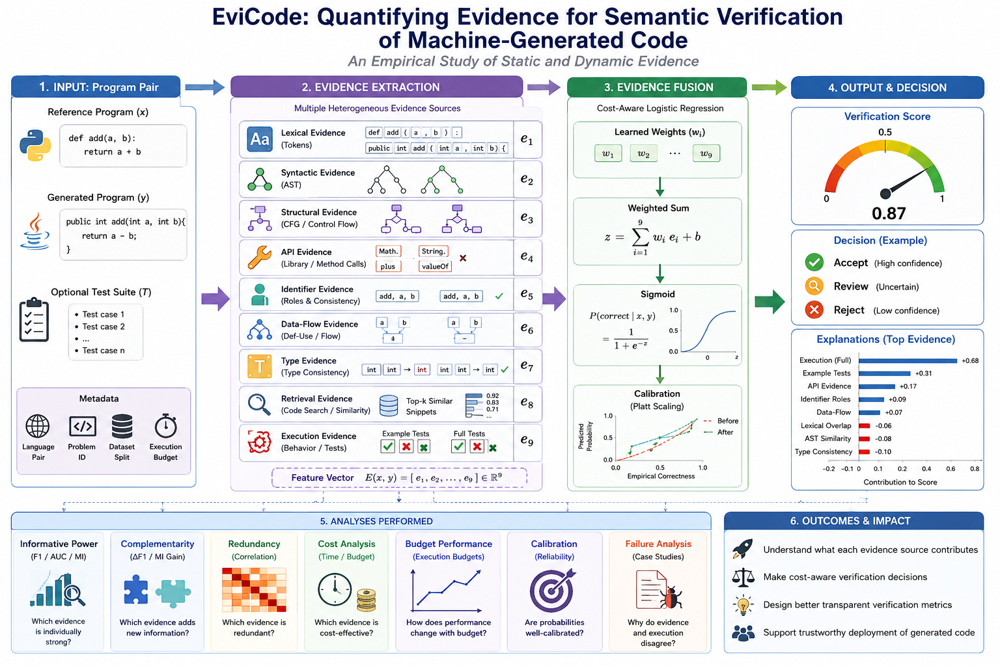

## Main Takeaway

Semantic verification is not a single metric problem. In the evaluated settings:

- Execution provides the strongest correctness evidence because it observes behavior.
- Static evidence cannot certify correctness, but language-normalized source-to-candidate evidence is useful for ranking, triage, and explanation.
- Raw token overlap, edit similarity, and raw AST node similarity are retained only as weak cross-language proxies, not as primary semantic evidence.
- Evidence fusion is most valuable as calibrated confidence and explanation, not as a replacement for execution.
- The results support an empirical evidence hierarchy: surface plausibility, validity, structure, program obligations, and observed behavior.

## Evidence Families

EviCode now organizes language-normalized evidence into four families:

| Family | Examples | Role |
|---|---|---|
| Structural | loops, branches, nesting, CFG-size proxies, statement distribution | captures program organization across languages |
| Behavioral | operators, returns, exceptions, calls, identifier roles, data-flow summaries | captures operation and value-movement evidence |
| Complexity | cyclomatic complexity, decision density, expression density, assignment density | captures decision and expression structure |
| Reliability | parse success, syntax validity, execution availability, confidence | captures whether evidence and behavior can be trusted |

Family ablation shows that the families contribute different kinds of evidence. Behavioral-only evidence reaches F1 `0.389` and AUC `0.711`; structural-only evidence reaches F1 `0.329` and AUC `0.734`; removing reliability evidence has the largest static impact in the current implementation, reducing static F1 to `0.436`.

## Dataset Snapshot

| Setting | Value |
|---|---:|
| HumanEval-X verification examples | 2,952 |
| Underlying tasks | 164 |
| Positive pairs | 984 |
| Controlled negative pairs | 1,968 |
| External Python-to-Java LLM translations | 7,312 |
| LLM generators | DeepSeekCoder, QwenCoder, StarCoder |

## Results and Analysis

### RQ1: Which Evidence Is Informative?

The first result is a discontinuity between representation-based and behavior-based verification. Static evidence reaches useful ranking quality, but execution changes the task from estimating semantic plausibility to observing tested behavior.

| Evidence group | Accuracy | F1 | ROC-AUC |
|---|---:|---:|---:|
| Lexical | 0.682 | 0.362 | 0.732 |
| Syntactic | 0.666 | 0.096 | 0.636 |
| Structural | 0.692 | 0.281 | 0.630 |
| Semantic-static | 0.670 | 0.252 | 0.717 |
| Dynamic | 0.929 | 0.904 | 0.947 |
| Static fusion | 0.743 | 0.558 | 0.801 |
| Static + example execution | 0.900 | 0.859 | 0.933 |
| Static + full execution | 0.906 | 0.865 | 0.959 |
| All evidence | 0.908 | 0.869 | 0.959 |

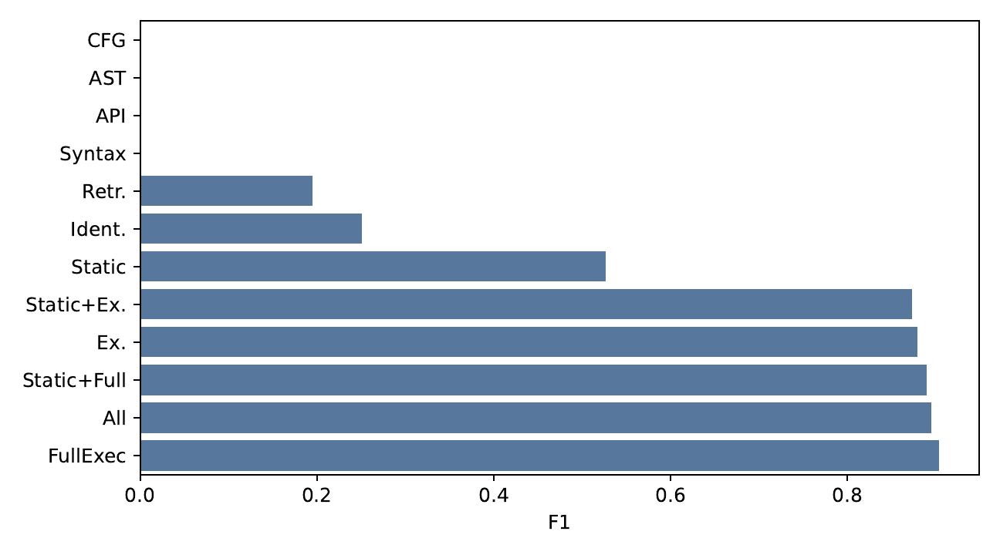

Static evidence has weaker thresholded F1 than execution, but its ROC-AUC of 0.801 shows that semantic plausibility is visible before execution. This matters for systems that need to prioritize candidates before paying for compilation, sandboxing, or full test execution.

### Evidence Informativeness

| Evidence source | Category | ROC-AUC | Mutual information |
|---|---|---:|---:|
| Full execution | Dynamic | 0.934 | 0.409 |
| Example execution | Dynamic | 0.913 | 0.356 |
| AST node similarity | Weak proxy | 0.550 | 0.109 |
| Token overlap | Weak proxy | 0.739 | 0.097 |
| Condition/operator patterns | Structural | 0.633 | 0.069 |
| Identifier overlap | Semantic-static | 0.709 | 0.053 |

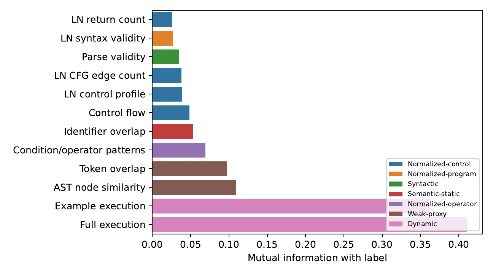

Execution carries roughly four times as much individual label information as the strongest static feature. The static signals are still useful because they fail differently. Raw AST and token overlap are now treated as weak proxies, while normalized operator, control, identifier-role, and data-flow features are the primary static evidence family.

### Evidence Hierarchy

| Evidence level | Features | F1 | ROC-AUC | Delta F1 |
|---|---:|---:|---:|---:|
| Weak proxy | 8 | 0.461 | 0.805 | 0.461 |
| Normalized program | 9 | 0.460 | 0.805 | -0.001 |
| Normalized control/structure | 31 | 0.478 | 0.806 | 0.018 |
| Normalized semantic-static | 45 | 0.558 | 0.801 | 0.081 |
| Dynamic | 47 | 0.869 | 0.959 | 0.311 |

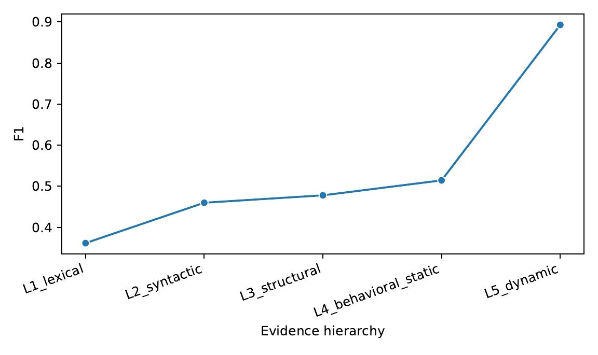

The hierarchy shows gradual static gains followed by a large dynamic transition. Normalized semantic-static evidence improves F1 to 0.558, while dynamic evidence adds the largest transition. This supports the view that verification follows progressive semantic observability rather than simple feature accumulation.

### RQ2: Which Evidence Is Complementary?

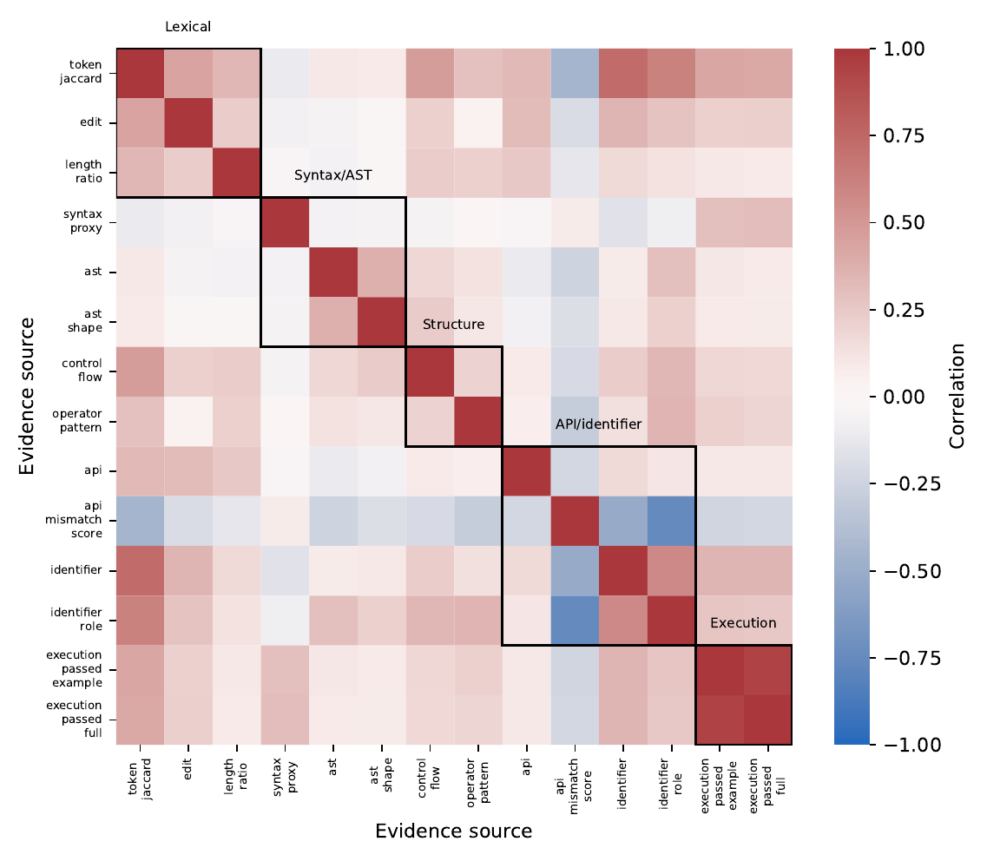

Complementarity is more important than feature count. Highly correlated blocks show redundant evidence families, while lower-correlation signals expose different failure surfaces. Operator evidence, API evidence, identifier-role evidence, and execution are useful because they disagree for interpretable reasons.

### RQ3: How Much Execution Is Necessary?

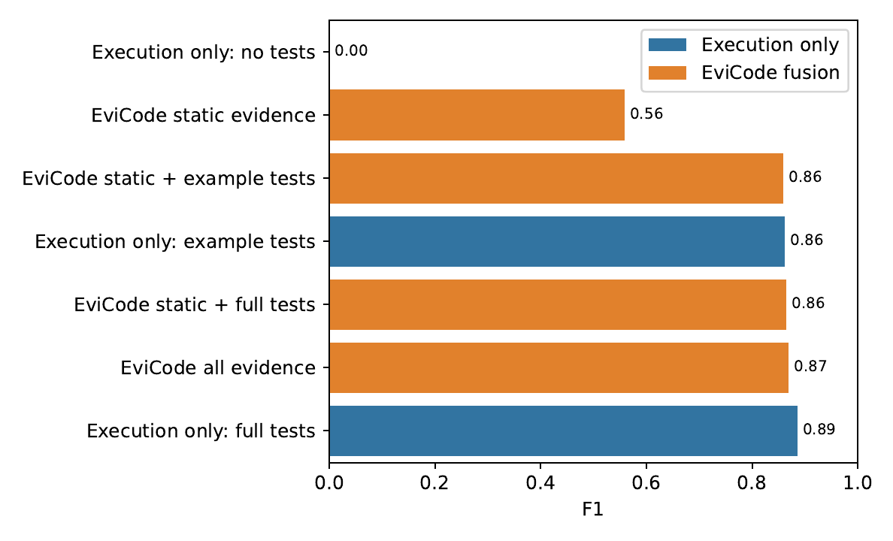

HumanEval-X exposes example and full tests, but not normalized individual test budgets. The supported evidence settings still show an important pattern: the first behavioral signal produces the largest gain. Static-only verification reaches F1 0.526, example execution reaches 0.862, and full execution reaches 0.885.

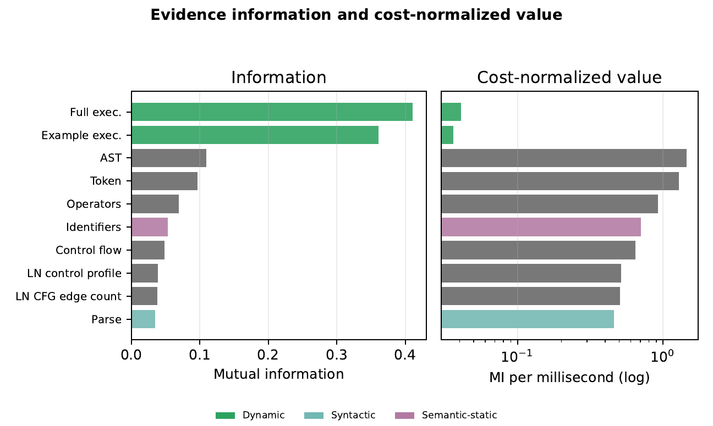

Cost changes what evidence is worth collecting. Execution has the strongest absolute information, but cheap static evidence has high cost-normalized value for early triage.

### RQ4: Can Evidence Explain Failures?

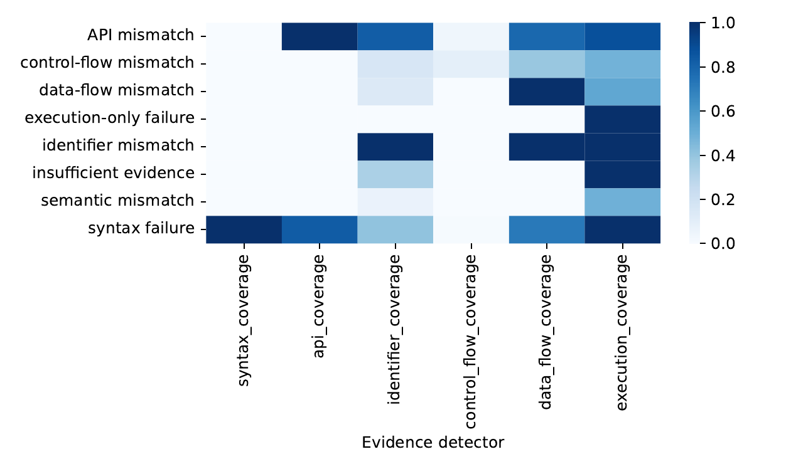

Evidence decomposition turns a binary incorrect label into diagnosable categories: syntax failure, API mismatch, data-flow mismatch, control-flow mismatch, and execution disagreement. This is important for repair and review workflows because the next action depends on why a candidate failed.

### RQ5: External LLM Validation and Calibration

| Generator | Rows | Empirical correctness | Mean confidence | ROC-AUC |
|---|---:|---:|---:|---:|
| DeepSeekCoder | 3,113 | 0.271 | 0.210 | 0.773 |
| QwenCoder | 1,740 | 0.190 | 0.254 | 0.664 |
| StarCoder | 2,459 | 0.091 | 0.099 | 0.296 |
| All external translations | 7,312 | 0.191 | 0.183 | 0.712 |

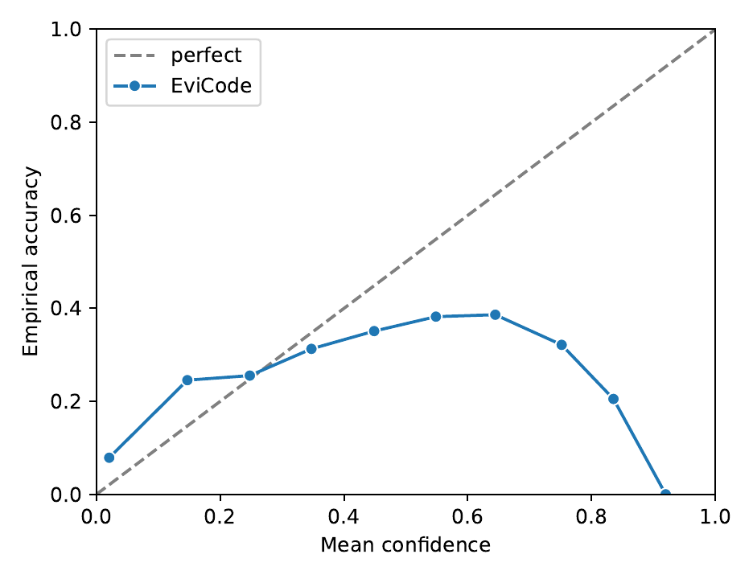

Static EviCode confidence transfers partially to real Python-to-Java LLM translations. It is not strong enough to replace execution, but it is useful as a triage and calibration signal.

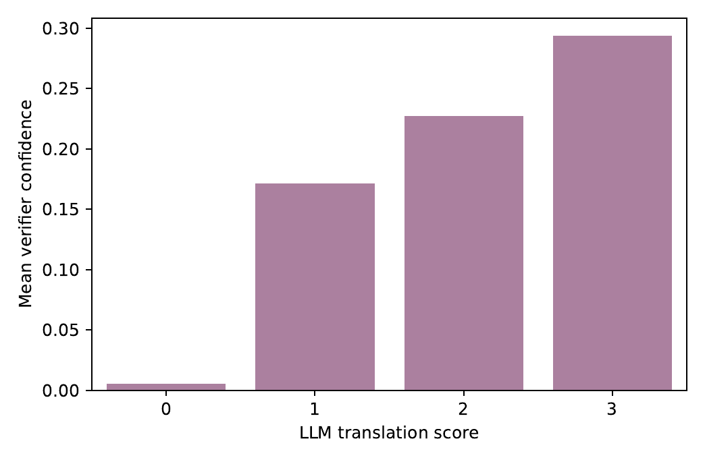

Confidence increases monotonically across graded outcomes: unusable translations, parsable-but-not-compilable translations, compilable-but-wrong translations, and functionally correct translations.

### Metrics Are Evidence, Not Judges

| Method | F1 | ROC-AUC | Interpretation |
|---|---:|---:|---|
| BLEU | 0.028 | 0.685 | Surface resemblance; poor correctness boundary |
| CrystalBLEU | 0.022 | 0.714 | Surface resemblance with filtering |
| TF-IDF | 0.530 | 0.727 | Better ranking, still non-semantic |
| CodeBLEU | 0.559 | 0.728 | Structure-aware similarity proxy |
| Execution | 0.885 | 0.934 | Behavior-observing evidence |
| EviCode Static | 0.526 | 0.807 | Static ranking and triage |
| EviCode All | 0.894 | 0.958 | Evidence-fused confidence |

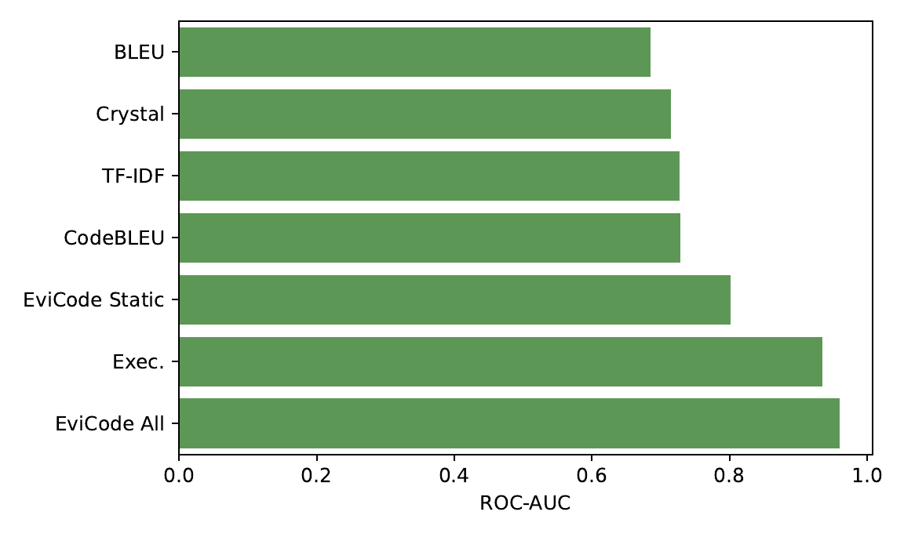

The metric comparison shows why similarity metrics should be interpreted as partial evidence sources rather than semantic judges.

## Repository Contents

| Path | Purpose |
|---|---|
| `src/evicode/` | Evidence extraction, feature handling, execution helpers, and fusion utilities |
| `scripts/` | Resume-safe dataset, evidence, experiment, statistics, artifact, and paper scripts |
| `configs/` | Reproducible experiment configurations |
| `datasets/processed/` | Processed HumanEval-X verification examples |
| `datasets/Predictions_by_LLMs/` | External Python-to-Java LLM predictions tracked with Git LFS |
| `experiments/` | Evidence and fusion outputs |
| `statistics/` | Bootstrap and McNemar validation outputs |
| `figures/`, `tables/` | Generated paper artifacts |
| `paper/main.tex` | Single-file manuscript source |
| `docs/` | Reproduction, architecture, user, and reviewer notes |

See `docs/LANGUAGE_NORMALIZED_EVIDENCE.md` for the evidence-source classification and mathematical definition of the language-normalized profile features.

## Setup

```bash
python -m venv .venv
source .venv/bin/activate  # Windows: .venv\Scripts\activate
python -m pip install --upgrade pip
python -m pip install -r requirements.txt
python -m pip install -r requirements-dev.txt
python -m pip install -e .
```

Large prediction JSONL files are tracked with Git LFS. After cloning:

```bash
git lfs install
git lfs pull
```

## Smoke Test

```bash
python -m pytest
python scripts/run_smoke.py --config configs/smoke.yaml --output-dir experiments/smoke --resume
```

## Full Reproduction

```bash
python scripts/build_humanevalx.py --config configs/humanevalx.yaml --output-dir datasets/processed/humanevalx --resume
python scripts/extract_evidence.py --config configs/humanevalx.yaml --input datasets/processed/humanevalx/verification_examples.jsonl --output-dir experiments/humanevalx/evidence --resume
python scripts/refresh_static_evidence.py --config configs/humanevalx.yaml --examples datasets/processed/humanevalx/verification_examples.jsonl --evidence experiments/humanevalx/evidence/evidence.jsonl --output-dir experiments/humanevalx/evidence_rich --resume
python scripts/run_experiments.py --config configs/humanevalx.yaml --input experiments/humanevalx/evidence_rich/evidence.jsonl --output-dir experiments/humanevalx/fusion_rich --resume
python scripts/statistical_analysis.py --config configs/humanevalx.yaml --predictions experiments/humanevalx/fusion_rich/predictions.csv --output-dir statistics/humanevalx_rich --resume
python scripts/analyze_evidence.py --config configs/humanevalx.yaml --examples datasets/processed/humanevalx/verification_examples.jsonl --evidence experiments/humanevalx/evidence_rich/evidence.jsonl --metrics experiments/humanevalx/fusion_rich/metrics.csv --output-dir results/analysis --resume
python scripts/evaluate_llm_predictions.py --config configs/humanevalx.yaml --predictions-dir datasets/Predictions_by_LLMs --train-evidence experiments/humanevalx/evidence_rich/evidence.jsonl --output-dir results/llm_predictions --resume
python scripts/generate_artifacts.py --config configs/humanevalx.yaml --dataset datasets/processed/humanevalx/verification_examples.jsonl --evidence experiments/humanevalx/evidence_rich/evidence.jsonl --metrics experiments/humanevalx/fusion_rich/metrics.csv --statistics-dir statistics/humanevalx_rich --output-dir results/humanevalx_rich --resume
python scripts/build_paper.py --config configs/humanevalx.yaml --output-dir paper/output --resume --force
```

More detail is available in `SETUP.md`, `REPRODUCIBILITY.md`, `PROJECT_STATUS.md`, and `docs/REPRODUCTION_GUIDE.md`.
